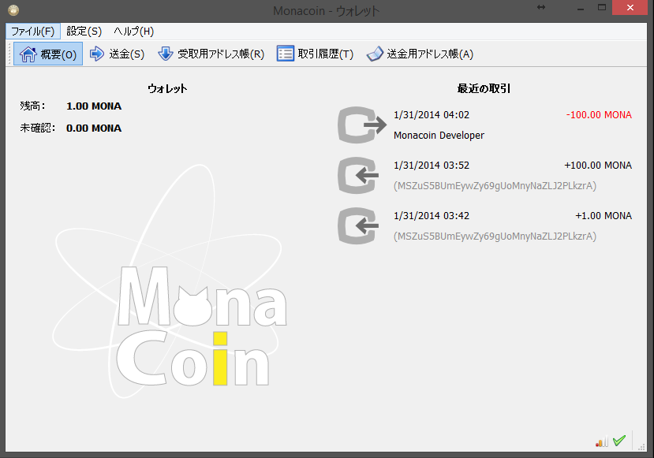

# Monacoin クライアント（日本語での利用が可能です）
#### Windows用
- [インストーラー版](https://github.com/keystore00/monacoin/releases/download/v0.8.6.1-20140131/monacoin-0.8.6.1-win32-setup.exe "download")
- [ポータブル版](https://github.com/keystore00/monacoin/releases/download/v0.8.6.1-20140131/monacoin-qt.zip "download")
- [CLI版 monacoind.exe](https://github.com/keystore00/monacoin/releases/download/v0.8.6.1-20140131/monacoind.exe "download")
#### Linux用
- [Linux用一式(32bit/64bit)](https://github.com/keystore00/monacoin/releases/download/v0.8.6.1-20140131/monacoin-linux.zip "download")
#### Android用 (alpha)
- [Android版](https://github.com/keystore00/monacoin-wallet-new/releases/download/v0.07-alpha/wallet-0.07.apk "download")
# Other softwares
- [2ch専ブラ用スクリプト](https://github.com/keystore00/monaext, "Go to monaext")
    - 2ch browser script for monacoin
- [マインクラフト用プラグイン](https://github.com/keystore00/Monacoinish, "Monacoinish")
    - Bukkit plugin for monacoin
    - [Monacraft](http://monacoin.sv73.net/monacraft.php, "Go to monacraft")
    -   
# Screeenshots

