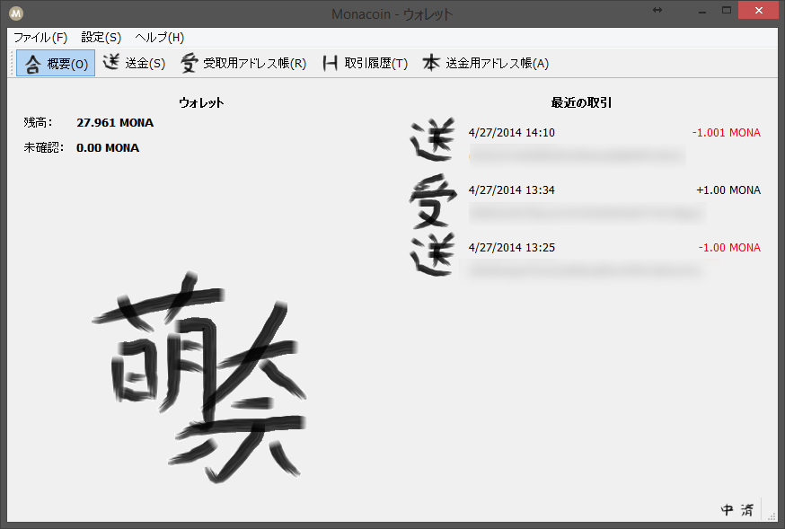

# How to customize your monacoin-qt

## Monacoinクライアントのカスタマイズ方法(サンプル)
- [サンプル](https://github.com/keystore00/monacoin/releases/download/v0.8.6.2-custom-fix/custom.zip "download sample")をダウンロード
- custom.zipを解凍して`%AppData%\Monacoin`に配置（配置例：`%AppData%\Monacoin\custom\address-book.png`）
- monacoin-qtを起動  
*datadirを変更している場合は、datadir以下にcustomディレクトリを作成してください。
