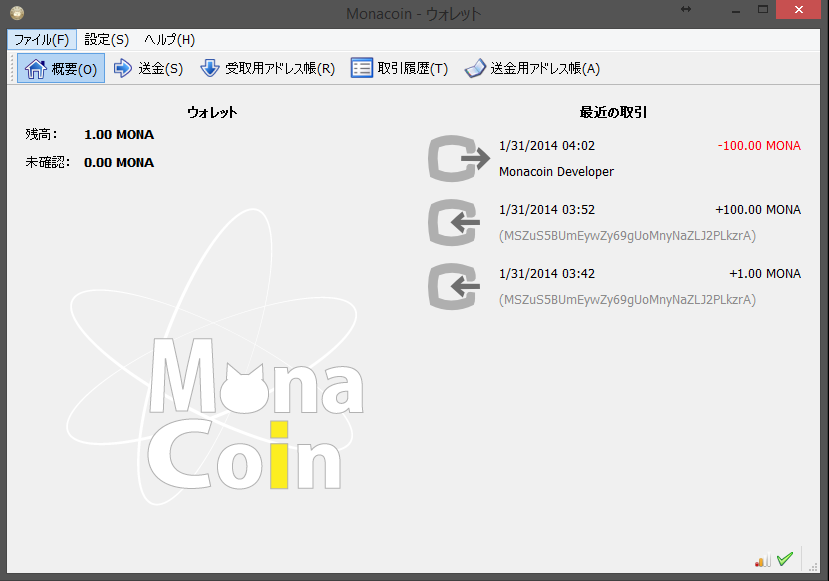
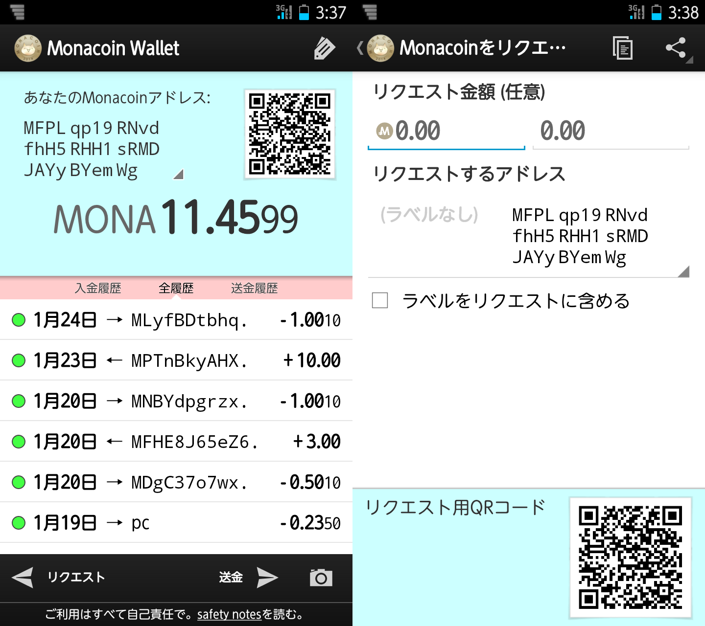

# Monacoin クライアント（日本語OK）

#### Windows用
- [インストーラ版](https://github.com/keystore00/monacoin/releases/download/v0.8.6.1-20140131/monacoin-0.8.6.1-win32-setup.exe "download")
- [ポータブル版](https://github.com/keystore00/monacoin/releases/download/v0.8.6.1-20140131/monacoin-qt.zip "download")
- [CLI版](https://github.com/keystore00/monacoin/releases/download/v0.8.6.1-20140131/monacoind.exe "download")

#### Linux
- [Linux用一式(32bit/64bit)](https://github.com/keystore00/monacoin/releases/download/v0.8.6.1-20140131/monacoin-linux.zip "download")
    - monacoin-qt
    - monacoind
    - src

#### Android (alpha)
- [Android版](https://github.com/keystore00/monacoin-wallet-new/releases/download/v0.07-alpha/wallet-0.07.apk "download")

# Other softwares
- [2ch専ブラ用スクリプト](https://github.com/keystore00/monaext "Go")
    - 2ch browser script for monacoin
- [マインクラフト用プラグイン](https://github.com/keystore00/Monacoinish/releases/download/v1.02/Monacoinish-1.02.jar, "Download")
    - Bukkit plugin for monacoin

# Screenshots

